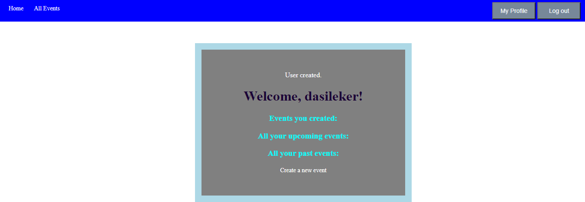

## Private Events

Created as part of The Odin Project's [Rails Project: Associations](https://www.theodinproject.com/courses/ruby-on-rails/lessons/associations?ref=lnav), this app allows users to organize private event networks through invitations.

Currently attendees must be added to events via the command line. Invitations will be added later.

## Built With :

- Ruby   => <a href="https://icons8.com/icon/4mBPKZ320Bgr/ruby-programming-language">Ruby Programming Language icon by Icons8</a>

- Ruby on Rails

- Rspec

## Project result

## Live Demo Link

## How to run the proaject

- Open the terminal or bash and type <code> git clone https://github.com/dasileker/private-events</code>

- to log in the folder type CD private-events

- Then type in  the Terminal yarn --check-files

- Bundle install 

- rails db:migrate

- Now you can run the server to see t he project final results: rails s

## Author 

**Zerradi Amine**

- zerradi amine (@dasileker): (<code>github.com/dasileker/private-events</code>)

## License

- This project is MIT license

## Support

- give a star if you like it 

